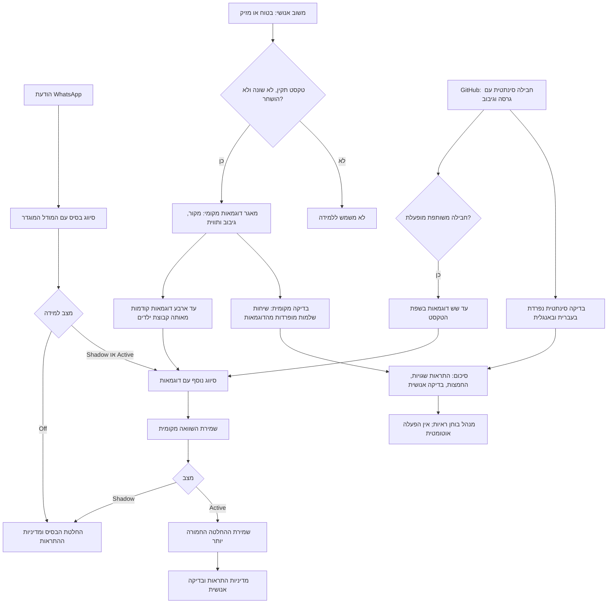
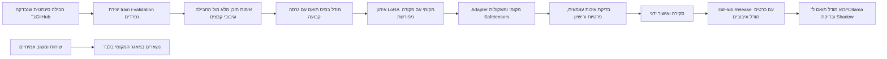

# מסלול הלמידה של Iris

Iris לומד ממשוב באמצעות דוגמאות שמתווספות להקשר של Ollama. שינוי משקולות הוא
מסלול נפרד, שמופעל ידנית מחוץ לאפליקציה. אין הבטחה שמודל טוב יותר מהמשתמשים:
בודקים אם השינוי משפר זיהוי ומפחית התראות שגויות ביחס למודל הבסיס.

## תרשים התהליך



## לוגיקה וכללים

1. משוב בטוח/מזיק על טקסט מתאים נקלט אוטומטית. התעלמות, דיווח על מידע חסר,
   מדיה ומקור שנמחק, השתנה או הושחר אינם דוגמאות לימוד תקפות.
2. שליפת משוב פרטי מוגבלת לדוגמאות קודמות מאותה קבוצת ילדים. הודעת היעד אינה
   יכולה ללמד את עצמה. מחיקת המקור מוחקת גם את הדוגמה הצמודה אליו.
3. החבילה הציבורית מכילה דוגמאות שנכתבו באופן סינתטי בלבד. היא אינה נוצרת
   משיחות או ממשוב משתמשים. היא מגיעה כחלק מגרסת Iris, ללא הורדת קוד מ־GitHub בזמן ריצה.
4. Shadow שומר השוואה ומשאיר את ההתראות לפי הבסיס. Active יכול להחמיר החלטה,
   אך אינו מבטל החלטת בסיס חמורה. Off מפסיק את הסיווג הנוסף.
5. בדיקת משוב מחזיקה חמישית מהשיחות מחוץ לשליפת הדוגמאות, לפי חלוקה יציבה.
   מוצגים סיכומים בלבד. המשוב האנושי הוא אמת המידה לבדיקה, ולא אמת מוחלטת.
6. שער הבדיקה דורש לפחות 100 דוגמאות מוחזקות בחוץ, ובהן 30 בטוחות ו־30 מזיקות,
   ללא כשלים, ללא תוספת החמצות/התראות שגויות, דיוק וזיהוי של לפחות 95%, ושיפור
   לעומת הבסיס. אלו כללי סינון ראשוניים; הם אינם הוכחה סטטיסטית או אישור לפרסום משקולות.
   בדיקה סינתטית לבדה לעולם אינה מספיקה. אין מעבר אוטומטי ל־Active.

## מסלול אימון משקולות ושיתוף

**שיתוף כבוי כברירת מחדל.** בתפריט המשתמש נמצא ״אישור שיתוף לצורכי למידה״.
האישור נשמר לפי משתמש וכולל אישור מפורש למדיניות, עם מועד עדכון ואפשרות לביטול.
מנהל אינו יכול לאשר בשם משתמש אחר. קבלת החבילה הציבורית אינה מעניקה אישור שיתוף.
כרגע אין מנגנון העלאה אוטומטי; האישור הוא תנאי מקדים לכל מסלול תרומה עתידי,
ואינו מתיר ייצוא הודעות או משוב פרטי. פרסום הקוד והדוגמאות הסינתטיות שנכתבו
לפיתוח אינו מפרסם מידע משתמשים ואינו משנה את ההסכמה שלהם.



הפקודות להכנה ואימות אינן מורידות מודלים ואינן ניגשות למסד הנתונים:

```powershell
python scripts/prepare_learning_model.py --base-model <compatible-model-id> --revision <pinned-commit>
python scripts/train_learning_adapter.py --dataset .local/learning-training
```

אימון הוא פעולה מפורשת, בסביבה נפרדת עם PyTorch, Transformers, PEFT ו־Accelerate:

```powershell
python -m pip install -r scripts/learning-training-requirements.txt
python scripts/train_learning_adapter.py --dataset .local/learning-training --train
```

ברירת המחדל משתמשת במודל שכבר קיים מקומית. `--allow-download` מאפשר הורדה מפורשת.
מודל Ollama מכווץ אינו בהכרח בסיס מתאים לאימון: נדרשים משקולות בסיס ותבנית שיחה
תואמות. הסקריפט שומר adapter, ואינו ממזג, ממיר ל־GGUF, מפרסם או מחליף את המודל הפעיל.

כל תוצר אימון מסומן `publishable_weights=false`. הכנה ואימון על 12 הדוגמאות
הראשונות הם מסלול ניסויי, ולא מספיקים לשיפור מוכח. גם משקולות עלולות לחשוף
נתוני אימון; הסרת שמות לבדה אינה מאפשרת פרסום נתונים אמיתיים. מסלול זה דוחה
כל תוכן שאינו זהה לחבילה הסינתטית המאושרת, גם אם שונו הגיבובים והצהרת הפרטיות.

לפני פרסום עתידי: להרחיב דוגמאות סינתטיות, לשמור סט בדיקה עצמאי שלא שימש לכוונון,
לבדוק עברית ואנגלית וקטגוריות חסרות, ולצרף מקור בסיס/גרסה, רישיון, מגבלות ותוצאות.
קבצי משקולות גדולים מתאימים ל־GitHub Releases או LFS. אין העלאה אוטומטית של מידע פרטי.

## מיפוי לקוד

| רכיב | קובץ |
|---|---|
| חבילה ציבורית | [community-learning.json](app/assets/community-learning.json) |
| אימות ושליפת חבילה | [community.py](app/classify/community.py) |
| קליטת משוב והשוואה | [learning.py](app/classify/learning.py) |
| בדיקה סינתטית ושער איכות | [evaluation.py](app/classify/evaluation.py) |
| בדיקת שיחות מוחזקות בחוץ | [benchmark_learning.py](app/classify/benchmark_learning.py) |
| API ניהול ובדיקות | [learning.py](app/api/learning.py) |
| הכנת נתונים סינתטיים | [prepare_learning_model.py](scripts/prepare_learning_model.py) |
| אימון מקומי ואימות פרטיות | [train_learning_adapter.py](scripts/train_learning_adapter.py) |

תיעוד תשתיות: [ייבוא ל־Ollama](https://docs.ollama.com/import),
[LoRA ב־PEFT](https://huggingface.co/docs/peft/package_reference/lora),
[מגבלות קבצים ב־GitHub](https://docs.github.com/en/repositories/working-with-files/managing-large-files/about-large-files-on-github),
[סיכון חשיפת מידע מעדכוני מודל](https://www.nist.gov/blogs/cybersecurity-insights/privacy-attacks-federated-learning).
